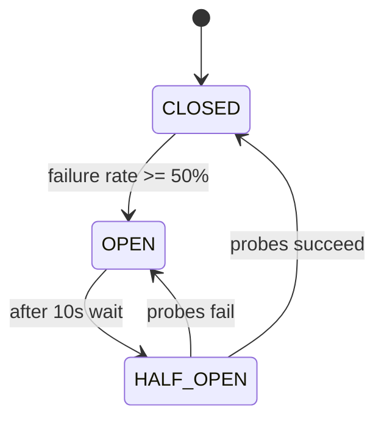

# API Development Guide (Three Rivers Bank)

This is the definitive implementation guide for backend API work in this repository.

Implementation references:
- [backend/src/main/java/com/threeriversbank/controller/CreditCardController.java](../../backend/src/main/java/com/threeriversbank/controller/CreditCardController.java)
- [backend/src/main/java/com/threeriversbank/service/CreditCardService.java](../../backend/src/main/java/com/threeriversbank/service/CreditCardService.java)
- [backend/src/main/java/com/threeriversbank/client/BianApiClient.java](../../backend/src/main/java/com/threeriversbank/client/BianApiClient.java)
- [backend/src/main/java/com/threeriversbank/client/BianApiClientConfig.java](../../backend/src/main/java/com/threeriversbank/client/BianApiClientConfig.java)
- [backend/src/main/java/com/threeriversbank/config/CacheConfig.java](../../backend/src/main/java/com/threeriversbank/config/CacheConfig.java)
- [backend/src/main/java/com/threeriversbank/config/CorsConfig.java](../../backend/src/main/java/com/threeriversbank/config/CorsConfig.java)
- [backend/src/main/resources/application.yml](../../backend/src/main/resources/application.yml)

## 1. Critical Data Source Guardrails

> [!WARNING]
> H2 is the system of record for card catalog and pricing metadata. Never query BIAN for catalog, fee, or interest data.

### Source of Truth Rules

- H2 PRIMARY:
  - Card catalog
  - Fee schedules
  - Interest rates
- BIAN SUPPLEMENTARY:
  - Transactions
  - Billing

### Endpoint to Data Source Matrix

| Endpoint | Controller Method | Service Method | Source |
|---|---|---|---|
| `GET /api/cards` | `getAllCards(...)` | `getAllCreditCards()`, `getCardsByType()`, `getCardsWithNoAnnualFee()` | H2 |
| `GET /api/cards/{id}` | `getCardById(Long id)` | `getCreditCardById(Long id)` | H2 |
| `GET /api/cards/{id}/fees` | `getCardFees(Long id)` | `getCardFees(Long cardId)` | H2 |
| `GET /api/cards/{id}/interest` | `getCardInterestRates(Long id)` | `getCardInterestRates(Long cardId)` | H2 |
| `GET /api/cards/{id}/transactions` | `getCardTransactions(Long id)` | `getCardTransactions(Long cardId)` | BIAN-path + fallback/sample |
| `GET /api/cards/{id}/billing` | `getCardBilling(Long id)` | `getCardBilling(Long cardId)` | BIAN-path + fallback/sample |

### Correct Pattern (H2 for primary data)

```java
@Transactional(readOnly = true)
public List<FeeScheduleDto> getCardFees(Long cardId) {
    log.info("Fetching fee schedule for card id: {}", cardId);
    return feeScheduleRepository.findByCreditCardId(cardId).stream()
            .map(this::convertToFeeDto)
            .collect(Collectors.toList());
}
```

### Incorrect Pattern (DO NOT DO THIS)

```java
// Incorrect: fee data must not come from BIAN
public List<FeeScheduleDto> getCardFees(Long cardId) {
    Map<String, Object> remote = bianApiClient.retrieveCreditCard(cardId);
    return mapRemoteFees(remote);
}
```

## 2. Controller Layer Patterns

Reference: [backend/src/main/java/com/threeriversbank/controller/CreditCardController.java](../../backend/src/main/java/com/threeriversbank/controller/CreditCardController.java)

### Required Annotation Stack

```java
@RestController
@RequestMapping("/api/cards")
@RequiredArgsConstructor
@Slf4j
@Tag(name = "Credit Cards", description = "Three Rivers Bank Business Credit Card API")
public class CreditCardController {
```

### OpenAPI Pattern

- Use `@Operation(summary = ..., description = ...)` on every endpoint.
- Current code uses `@Tag` + `@Operation` only (no `@ApiResponse`).

```java
@GetMapping("/{id}")
@Operation(summary = "Get credit card by ID", description = "Returns detailed information for a specific credit card")
public ResponseEntity<CreditCardDto> getCardById(@PathVariable Long id) {
    log.info("GET /api/cards/{}", id);
    CreditCardDto card = creditCardService.getCreditCardById(id);
    return ResponseEntity.ok(card);
}
```

### Query Parameter and Null-Safe Boolean Pattern

```java
@GetMapping
public ResponseEntity<List<CreditCardDto>> getAllCards(
        @RequestParam(required = false) String cardType,
        @RequestParam(required = false) Boolean noAnnualFee) {
    log.info("GET /api/cards - cardType: {}, noAnnualFee: {}", cardType, noAnnualFee);

    List<CreditCardDto> cards;
    if (cardType != null) {
        cards = creditCardService.getCardsByType(cardType);
    } else if (Boolean.TRUE.equals(noAnnualFee)) {
        cards = creditCardService.getCardsWithNoAnnualFee();
    } else {
        cards = creditCardService.getAllCreditCards();
    }

    return ResponseEntity.ok(cards);
}
```

### Controller Error Handling Rule

> [!WARNING]
> Do not add local controller `try/catch` or `@ControllerAdvice` unless explicitly requested. Current pattern lets service throw `RuntimeException`.

## 3. Service Layer Patterns

Reference: [backend/src/main/java/com/threeriversbank/service/CreditCardService.java](../../backend/src/main/java/com/threeriversbank/service/CreditCardService.java)

### Required Annotation Stack

```java
@Service
@RequiredArgsConstructor
@Slf4j
public class CreditCardService {
```

### H2 Query Methods are Read-Only Transactions

```java
@Transactional(readOnly = true)
public CreditCardDto getCreditCardById(Long id) {
    log.info("Fetching credit card with id: {} from H2 database", id);
    CreditCard card = creditCardRepository.findById(id)
            .orElseThrow(() -> new RuntimeException("Credit card not found with id: " + id));
    return convertToDtoWithDetails(card);
}
```

### Circuit Breaker Stack for BIAN-Supplementary Reads

```java
@Cacheable(value = "transactions", key = "#cardId")
@CircuitBreaker(name = "bianApi", fallbackMethod = "getTransactionsFallback")
@Retry(name = "bianApi")
public List<CardTransactionDto> getCardTransactions(Long cardId) {
    log.info("Fetching transactions for card id: {} from BIAN API", cardId);
    try {
        return getSampleTransactions(cardId);
    } catch (Exception e) {
        log.error("Error fetching transactions from BIAN API: {}", e.getMessage());
        throw e;
    }
}

public List<CardTransactionDto> getTransactionsFallback(Long cardId, Exception ex) {
    log.warn("Using fallback for transactions for card id: {} due to: {}", cardId, ex.getMessage());
    return getSampleTransactions(cardId);
}
```

### Manual Entity-to-DTO Mapping (No MapStruct)

```java
private CreditCardDto convertToDto(CreditCard card) {
    return CreditCardDto.builder()
            .id(card.getId())
            .name(card.getName())
            .cardType(card.getCardType())
            .annualFee(card.getAnnualFee())
            .introApr(card.getIntroApr())
            .regularApr(card.getRegularApr())
            .rewardsRate(card.getRewardsRate())
            .signupBonus(card.getSignupBonus())
            .creditScoreNeeded(card.getCreditScoreNeeded())
            .foreignTransactionFee(card.getForeignTransactionFee())
            .description(card.getDescription())
            .features(card.getFeatures())
            .benefits(card.getBenefits())
            .build();
}

private CreditCardDto convertToDtoWithDetails(CreditCard card) {
    CreditCardDto dto = convertToDto(card);
    dto.setCardFeatures(card.getCardFeatures().stream().map(this::convertToFeatureDto).collect(Collectors.toList()));
    dto.setFeeSchedules(card.getFeeSchedules().stream().map(this::convertToFeeDto).collect(Collectors.toList()));
    dto.setInterestRates(card.getInterestRates().stream().map(this::convertToInterestDto).collect(Collectors.toList()));
    return dto;
}
```

### RuntimeException Pattern for Not Found

```java
CreditCard card = creditCardRepository.findById(id)
        .orElseThrow(() -> new RuntimeException("Credit card not found with id: " + id));
```

## 4. Resilience4j Configuration

Configuration source: [backend/src/main/resources/application.yml](../../backend/src/main/resources/application.yml)

### Runtime Settings

| Feature | Property | Value |
|---|---|---|
| Circuit breaker failure threshold | `resilience4j.circuitbreaker.instances.bianApi.failure-rate-threshold` | `50` |
| Circuit breaker open wait | `resilience4j.circuitbreaker.instances.bianApi.wait-duration-in-open-state` | `10000` (ms) |
| Circuit breaker sliding window | `resilience4j.circuitbreaker.instances.bianApi.sliding-window-size` | `10` |
| Retry max attempts | `resilience4j.retry.instances.bianApi.max-attempts` | `3` |
| Retry wait duration | `resilience4j.retry.instances.bianApi.wait-duration` | `1000` (ms) |
| Timeout duration | `resilience4j.timelimiter.instances.bianApi.timeout-duration` | `5s` |

### Current Config Snippet

```yaml
resilience4j:
  circuitbreaker:
    instances:
      bianApi:
        sliding-window-size: 10
        failure-rate-threshold: 50
        wait-duration-in-open-state: 10000
        permitted-number-of-calls-in-half-open-state: 3
        automatic-transition-from-open-to-half-open-enabled: true
  retry:
    instances:
      bianApi:
        max-attempts: 3
        wait-duration: 1000
  timelimiter:
    instances:
      bianApi:
        timeout-duration: 5s
```

### State Transition Model



### Decorator Order (Project Guardrail)

`Cache -> CircuitBreaker -> Retry -> Fallback`

Use this annotation order on BIAN-supplementary methods:

```java
@Cacheable(...)
@CircuitBreaker(..., fallbackMethod = "...")
@Retry(...)
```

## 5. Caching Strategy

References:
- [backend/src/main/java/com/threeriversbank/config/CacheConfig.java](../../backend/src/main/java/com/threeriversbank/config/CacheConfig.java)
- [backend/src/main/resources/application.yml](../../backend/src/main/resources/application.yml)

### Cache Names and Key Pattern

| Cache | Key Pattern | Intended TTL |
|---|---|---|
| `transactions` | `#cardId` | 5 minutes |
| `billing` | `#cardId` | 1 hour |

```java
@Cacheable(value = "transactions", key = "#cardId")
public List<CardTransactionDto> getCardTransactions(Long cardId) { ... }

@Cacheable(value = "billing", key = "#cardId")
public BillingDto getCardBilling(Long cardId) { ... }
```

### Why H2 Data is Not Cached

- Card catalog, fees, and interest are already served from in-memory H2.
- Extra cache layer adds complexity with little value for local read path.

> [!WARNING]
> Current cache manager is `spring.cache.type: simple`; TTL is a project guardrail/documented policy, not currently enforced by `CacheConfig` implementation.

## 6. Repository Layer Patterns

References:
- [backend/src/main/java/com/threeriversbank/repository/CreditCardRepository.java](../../backend/src/main/java/com/threeriversbank/repository/CreditCardRepository.java)
- [backend/src/main/java/com/threeriversbank/repository/CardFeatureRepository.java](../../backend/src/main/java/com/threeriversbank/repository/CardFeatureRepository.java)
- [backend/src/main/java/com/threeriversbank/repository/FeeScheduleRepository.java](../../backend/src/main/java/com/threeriversbank/repository/FeeScheduleRepository.java)
- [backend/src/main/java/com/threeriversbank/repository/InterestRateRepository.java](../../backend/src/main/java/com/threeriversbank/repository/InterestRateRepository.java)

### Spring Data JPA Interface Pattern

```java
@Repository
public interface CreditCardRepository extends JpaRepository<CreditCard, Long> {

    List<CreditCard> findByCardType(String cardType);

    @Query("SELECT c FROM CreditCard c WHERE c.annualFee = 0")
    List<CreditCard> findCardsWithNoAnnualFee();
}
```

### Child Repository Pattern

```java
@Repository
public interface FeeScheduleRepository extends JpaRepository<FeeSchedule, Long> {
    List<FeeSchedule> findByCreditCardId(Long cardId);
}
```

## 7. Entity Patterns

References:
- [backend/src/main/java/com/threeriversbank/model/entity/CreditCard.java](../../backend/src/main/java/com/threeriversbank/model/entity/CreditCard.java)
- [backend/src/main/java/com/threeriversbank/model/entity/FeeSchedule.java](../../backend/src/main/java/com/threeriversbank/model/entity/FeeSchedule.java)
- [backend/src/main/java/com/threeriversbank/model/entity/InterestRate.java](../../backend/src/main/java/com/threeriversbank/model/entity/InterestRate.java)
- [backend/src/main/java/com/threeriversbank/model/entity/CardFeature.java](../../backend/src/main/java/com/threeriversbank/model/entity/CardFeature.java)

### Lombok + JPA Baseline

```java
@Entity
@Table(name = "credit_card")
@Data
@NoArgsConstructor
@AllArgsConstructor
public class CreditCard {
    @Id
    @GeneratedValue(strategy = GenerationType.IDENTITY)
    private Long id;
}
```

### Column Constraints and Precision

```java
@Column(nullable = false, length = 100)
private String name;

@Column(precision = 10, scale = 2)
private BigDecimal annualFee;

@Column(precision = 5, scale = 2)
private BigDecimal rewardsRate;
```

### Relationship Pattern and Collection Initialization

```java
@OneToMany(mappedBy = "creditCard", cascade = CascadeType.ALL, orphanRemoval = true)
private List<FeeSchedule> feeSchedules = new ArrayList<>();

@ManyToOne(fetch = FetchType.LAZY)
@JoinColumn(name = "card_id", nullable = false)
private CreditCard creditCard;
```

## 8. DTO Patterns

References:
- [backend/src/main/java/com/threeriversbank/model/dto/CreditCardDto.java](../../backend/src/main/java/com/threeriversbank/model/dto/CreditCardDto.java)
- [backend/src/main/java/com/threeriversbank/model/dto/CardFeatureDto.java](../../backend/src/main/java/com/threeriversbank/model/dto/CardFeatureDto.java)
- [backend/src/main/java/com/threeriversbank/model/dto/FeeScheduleDto.java](../../backend/src/main/java/com/threeriversbank/model/dto/FeeScheduleDto.java)
- [backend/src/main/java/com/threeriversbank/model/dto/InterestRateDto.java](../../backend/src/main/java/com/threeriversbank/model/dto/InterestRateDto.java)
- [backend/src/main/java/com/threeriversbank/model/dto/CardTransactionDto.java](../../backend/src/main/java/com/threeriversbank/model/dto/CardTransactionDto.java)
- [backend/src/main/java/com/threeriversbank/model/dto/BillingDto.java](../../backend/src/main/java/com/threeriversbank/model/dto/BillingDto.java)

### Standard DTO Annotations

```java
@Data
@Builder
@NoArgsConstructor
@AllArgsConstructor
public class CreditCardDto {
    private Long id;
    private String name;
    private List<CardFeatureDto> cardFeatures;
    private List<FeeScheduleDto> feeSchedules;
    private List<InterestRateDto> interestRates;
}
```

### DTO Guardrails

- Do not include parent entity references in child DTOs (prevents circular serialization).
- Nested collections are allowed on parent DTOs (`CreditCardDto`).
- External-only DTOs are valid: `CardTransactionDto` and `BillingDto` have no entity counterpart.

## 9. BIAN API Integration

References:
- [backend/src/main/java/com/threeriversbank/client/BianApiClient.java](../../backend/src/main/java/com/threeriversbank/client/BianApiClient.java)
- [backend/src/main/java/com/threeriversbank/client/BianApiClientConfig.java](../../backend/src/main/java/com/threeriversbank/client/BianApiClientConfig.java)

### Feign Client Pattern

```java
@FeignClient(
    name = "bian-api",
    url = "${bian.api.base-url}",
    configuration = BianApiClientConfig.class
)
public interface BianApiClient {

    @GetMapping("/CreditCard/{id}/Retrieve")
    Map<String, Object> retrieveCreditCard(@PathVariable("id") Long id);

    @GetMapping("/CreditCard/{id}/CardTransaction/{txid}/Retrieve")
    Map<String, Object> retrieveCardTransaction(@PathVariable("id") Long id, @PathVariable("txid") String txid);

    @GetMapping("/CreditCard/{id}/Billing/{billingid}/Retrieve")
    Map<String, Object> retrieveBilling(@PathVariable("id") Long id, @PathVariable("billingid") String billingid);
}
```

### Verified Usage Guardrail

> [!WARNING]
> `retrieveCreditCard()` is declared but not invoked by current service code. Keep it unused for catalog/fee/interest paths.

### BianApiClientConfig Pattern

```java
@Bean
Logger.Level feignLoggerLevel() {
    return Logger.Level.BASIC;
}

@Bean
public RequestInterceptor requestInterceptor() {
    return requestTemplate -> {
        requestTemplate.header("Accept", "application/json");
        requestTemplate.header("Content-Type", "application/json");
    };
}
```

## 10. CORS Configuration

Reference: [backend/src/main/java/com/threeriversbank/config/CorsConfig.java](../../backend/src/main/java/com/threeriversbank/config/CorsConfig.java)

```java
@Configuration
public class CorsConfig implements WebMvcConfigurer {

    @Value("${cors.allowed-origins:http://localhost:5173,http://localhost:5174,http://localhost:3000}")
    private String allowedOrigins;

    @Override
    public void addCorsMappings(CorsRegistry registry) {
        registry.addMapping("/api/**")
                .allowedOrigins(allowedOrigins.split(","))
                .allowedMethods("GET", "POST", "PUT", "DELETE", "OPTIONS")
                .allowedHeaders("*")
                .allowCredentials(true);
    }
}
```

## 11. Testing Patterns

References:
- [backend/src/test/java/com/threeriversbank/controller/CreditCardControllerTest.java](../../backend/src/test/java/com/threeriversbank/controller/CreditCardControllerTest.java)
- [backend/src/test/java/com/threeriversbank/repository/CreditCardRepositoryTest.java](../../backend/src/test/java/com/threeriversbank/repository/CreditCardRepositoryTest.java)

### Controller Tests: `@WebMvcTest` + `@MockBean`

```java
@WebMvcTest(CreditCardController.class)
class CreditCardControllerTest {

    @Autowired
    private MockMvc mockMvc;

    @MockBean
    private CreditCardService creditCardService;
}
```

```java
mockMvc.perform(get("/api/cards"))
        .andExpect(status().isOk())
        .andExpect(jsonPath("$").isArray())
        .andExpect(jsonPath("$.length()").value(2));
```

### Repository Tests: `@DataJpaTest` + AssertJ

```java
@DataJpaTest
class CreditCardRepositoryTest {

    @Autowired
    private TestEntityManager entityManager;

    @Autowired
    private CreditCardRepository creditCardRepository;
}
```

```java
List<CreditCard> freeCards = creditCardRepository.findCardsWithNoAnnualFee();
assertThat(freeCards).isNotEmpty();
assertThat(freeCards).allMatch(card -> card.getAnnualFee().compareTo(BigDecimal.ZERO) == 0);
```

### Test Guardrails

- Use DTO builders for test fixture creation (`CreditCardDto.builder()...`).
- No dedicated service-layer tests currently; behavior is covered via controller/repository tests.
- BIAN client must be mocked in tests; do not call external BIAN endpoints in test runs.

Command examples:

```bash
cd backend
mvn test
```

## 12. OpenAPI/Swagger Documentation

Reference: [backend/src/main/resources/application.yml](../../backend/src/main/resources/application.yml)

### Access Points

| Resource | Path |
|---|---|
| Swagger UI | `/swagger-ui.html` |
| OpenAPI Docs | `/api-docs` |

### Annotation Conventions

- Class-level `@Tag`.
- Method-level `@Operation` with summary + description.
- Current project intentionally keeps metadata minimal: no `@ApiResponse` annotations.

## Quick Guardrail Checklist

- Keep H2 as primary for catalog, fees, and interest rates.
- Use BIAN only for transactions and billing.
- Use `@Transactional(readOnly = true)` on H2 query methods.
- Use `@Cacheable + @CircuitBreaker + @Retry + fallback` on BIAN-supplementary methods.
- Keep mapping manual in service with builder-based DTOs.
- Keep controller responses uniform with `ResponseEntity.ok(...)`.
- Preserve existing test style (`@WebMvcTest`, `@DataJpaTest`, MockMvc, AssertJ).
